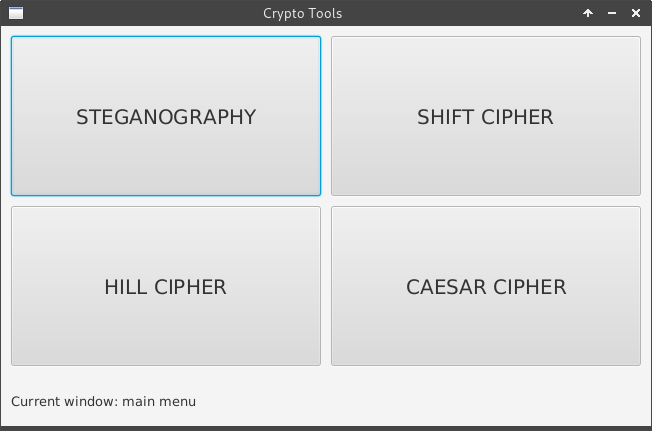
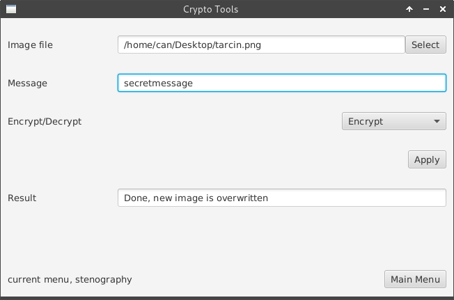
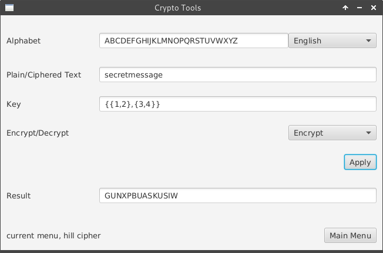
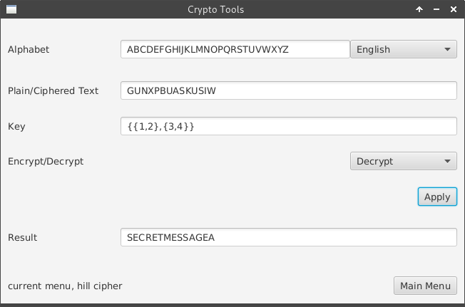

# Crypto Tools

A school project i had implemented for my cryptography class. Contains some cipher tools.  

* [Steganography](https://en.wikipedia.org/wiki/Steganography)
* [Shift Cipher](https://en.wikipedia.org/wiki/Substitution_cipher)
* [Ceaser Cipher](https://en.wikipedia.org/wiki/Caesar_cipher)
* [Hill Cipher](https://en.wikipedia.org/wiki/Hill_cipher)

# Build & Run

Make sure you have JavaFx on JAVA_SDK_ROOT/jre/lib/ext/jfxrt.jar

```sh
$ mvn jfx:jar
$ java -jar target/jfx/app/crypto-tools-jfx.jar
```

# Images





